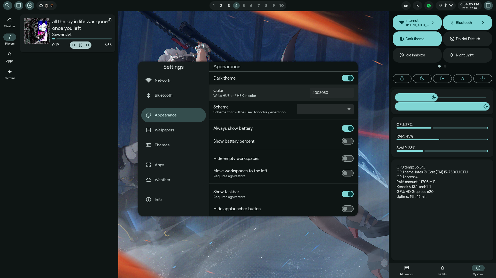

# Hyprland dotfiles installer for Arch

# ⚠️ Current Status

**This dotfiles setup is currently *not* working out of the box.**  
One of the core components (ags, which handles all the GUI panels like notifications and waybar replacement) no longer builds on newer systems. The original author of the upstream dotfiles (which this repo is heavily based on) has announced a complete rewrite of ags in a different language. However, until that happens, no updates or fixes are expected. As for this repository, there are no guarantees it will be updated to support the new ags version once it's released.


[](screenshots/screen.png)
[](screenshots/lockscreen.jpg)
## About these dots
The dotfiles were inspired by Material You design. Accent colors are generated automatically when you change wallpaper, but there is an option to enter HEX value manually

## Important info, credits

This script is designed for the latest version of Arch and can be used on a freshly installed Arch system or on an already existing Hyprland setup.

This project is an improved version of [these beautiful dotfiles by koeqaife](https://github.com/koeqaife/hyprland-material-you). Also I used several scripts and configs from [JaKooLit's dotfiles](https://github.com/JaKooLit/Arch-Hyprland). 
I don’t claim full authorship - I combined elements I liked and added a few personal touches.

## What was changed

- **Changed clock format to 12-hour clock format, added seconds (to taskbar and hyprlock)**.
- **Added installation and configuration of zsh**.
- **Added kitty configuration**.
- **More wallpapers**.
- And many other minor changes...

## How to install

First, you must have Arch installed. This can be a minimal installation without Hyprland or any DE/WM. Then:
   ```bash
   sudo pacman -Syu
   sudo pacman -S git
   git clone --depth=1 https://github.com/ayukuro/hyprdots.git
   cd hyprdots
   ./install.sh
